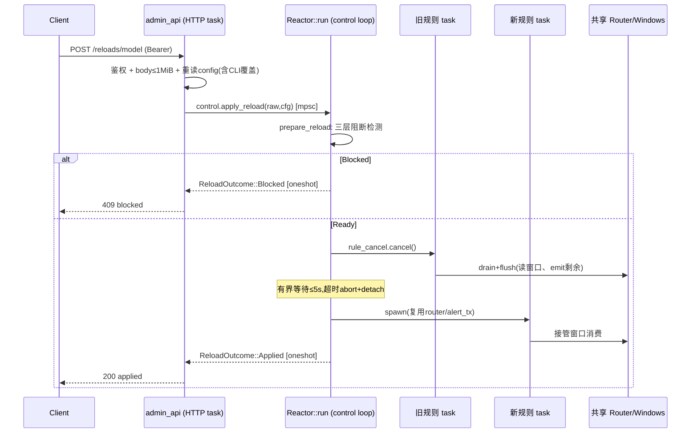
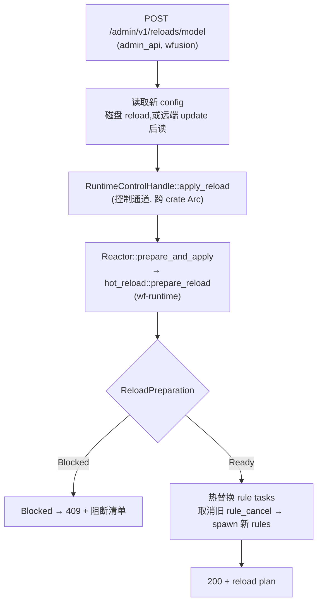
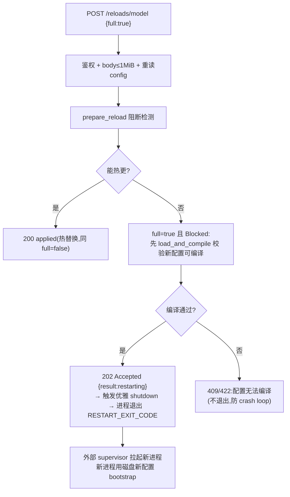
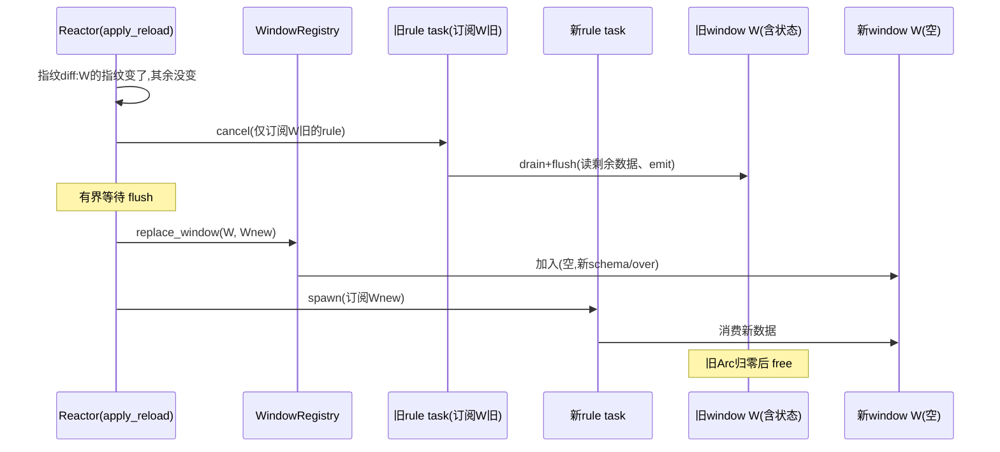

# admin_api reload 方案设计

> POST `/admin/v1/reloads/model` — 运行中的 wfusion daemon 收到请求后,触发 Reactor 热重载规则/配置(可选远端 update),返回结果。
>
> 覆盖范围:运行时逻辑、分层架构、接口契约、风险。

## reload 运行时逻辑(端到端)

> 一句话:**HTTP 请求 → 控制通道串行化 → 准备+阻断检测 → 热替换规则 task(共享窗口状态)→ 回复**。只有"规则内部逻辑"可热更;改 schema/window/运行时拓扑仍需重启 —— 默认 reload(`full:false`)此时返回 409,`full:true` 则升级为进程重启(见 §10)。

### 触发与鉴权(HTTP 层,wfusion `admin_api.rs`)

`POST /admin/v1/reloads/model`,Bearer token 鉴权(所有路由统一)。reload 路由:

1. **body 限流**:请求体用 `Limited::new(.., 1 MiB)` 读取后丢弃(body 暂不解析),超限 → `413`(防 DoS)。
2. **重读配置**:用启动时捕获的 `ReloadConfigSource`(`--config` 路径 + `--overlay` + `--var` 上下文)重建 `FusionConfigLoader`,读出 `(next_raw, next_config)`。
3. **重放 CLI 覆盖**:把启动时的 `--mode`/`--metrics*` 覆盖重新应用到 `next_config`(`apply_overrides`),保证与运行中引擎的基准一致 —— 否则 `--mode` 差异会被误判为需重启。

### 控制通道(串行化,wfusion → wf-runtime)

`AppState.control: RuntimeControlHandle`(clonable,跨 task 共享)。`apply_reload(raw, config)` 把请求经 `mpsc` 发给 Reactor,自己 `oneshot` 等回复。

- **串行保证**:Reactor 单消费者(`Reactor::run` 的控制循环),reload 逐个处理,无并发重载、无锁。
- **引擎已关停**:channel 关闭 → `send` 失败 → 回 `Err` → HTTP `500`。

### Reactor 控制循环(wf-runtime `lifecycle/mod.rs::run`)

`select!` 上两件事:`cancel.cancelled()`(信号/internal shutdown → break)与 `control_rx.recv()`(逐个 reload 请求)。收到请求 → 调 `apply_reload` → `oneshot` 回复。

### 准备与阻断检测(wf-runtime `hot_reload::prepare_reload`)

用 `current_raw/current_config`(运行中基准)与 `next_raw/next_config` 对比,三层检测,任一层命中即 `Blocked`:

1. **raw diff**(`build_reload_plan`):配置树顶层需重启项。
2. **effective config**:运行时行为字段变了(mode/sinks/sources/parallelism/schemas/windows/logging 等任一不一致)。
3. **topology**(关键):编译新旧产物,若 `runtime_schemas` 集合或 `runtime_window_configs` 变了 → 需重启(router/window registry 要重建)。

- `Blocked(plan)` → **不触碰运行任务**,回 `409 {result:"blocked", requires_restart:N}`。
- `Ready(PreparedRuleReload)` → 进入热替换。

### 热替换规则 task(`Reactor::apply_reload` → `swap_rule_tasks`)

规则 task 是**无状态消费者**:CEP 窗口状态(事件缓冲/聚合)在共享 `Arc<Router>`/window registry 中,rule task 只持有引用。所以换规则 task **不丢窗口数据**,receiver/alert/evictor/metrics 也都不停。

1. `rule_cancel.cancel()` —— 只停规则 task(它是 root cancel 的 child,root shutdown 仍能经父子链传播)。
2. **有界等待旧 task 退出**(`select!`,默认 5s):旧 task 的 `emit()` 在 alert 通道满时回退阻塞 `send().await`、**不响应 cancel**,背压下会卡;超时则 `abort()` 旧监督 handle 并存入 `detached_rule_watchers`(强制释放其 `alert_tx` clone,防 `wait()` 挂死),泄漏限制在「至多一个旧代」。
3. 重建 `rule_cancel`(新 child token),`spawn_rule_tasks` 生成新规则,复用共享 `router`/`alert_tx`/`metrics`/`intermediate_targets`。
4. 推进重载基准(`current_raw/current_config/intermediate_targets` ← 新值)。

→ 回 `200 {result:"applied", hot_reload:N, requires_restart:M}`。

### 优雅关停(`Reactor::wait`)

LIFO join:`alert_tx.take()`(drop Reactor 自己的 sender)→ tail(metrics,receiver)→ reap detached → rule → head(evictor,alert)。alert task 最后 join:前序 rule task 退出时 drop 各自 `alert_tx` clone,通道随后关闭,alert 排空退出。

### 时序



### 能力边界(什么能热更 / 什么不能)

| 可热重载(返回 200) | 需重启(返回 409,列阻断原因) |
|------|------|
| 规则内部逻辑变更(阈值、表达式、score、yield 字段值) | schema 集合变化(增删 `.wfs` window 定义) |
| 仅 `${VAR}` 取值变化的规则重编译 | window 配置变化(`over_cap`/window 布局) |
| | mode / sinks / sources / parallelism / rule_exec_timeout / window_defaults / logging 任一变化 |

语义说明:热替换会以 `CloseReason::Flush` **强制关闭旧规则的活跃 CEP 实例并产出告警**,新实例从当前窗口状态重新开始 —— 是「旧实例关闭 + 新实例接管」,**非跨版本状态迁移**。

---

## 2. 代码基础(本方案复用的既有能力)

### 2.1 热重载准备(`hot_reload::prepare_reload`,已实现)

`wp-reactor/crates/wf-runtime/src/hot_reload/mod.rs`,通过 `lifecycle/mod.rs` 重新导出为公开 API:

```rust
pub fn prepare_reload(
    current_raw: &RawFusionConfigTree,
    current_config: &FusionConfig,
    next_raw: RawFusionConfigTree,
    next_config: FusionConfig,
    base_dir: &Path,
) -> RuntimeResult<ReloadPreparation>;

pub enum ReloadPreparation {
    Ready(Box<PreparedRuleReload>),   // 可热重载,产物已编译
    Blocked(FusionReloadPlan),         // 不可热重载,附阻断原因清单
}

pub struct PreparedRuleReload {
    pub plan: FusionReloadPlan,
    pub next_raw: RawFusionConfigTree,
    pub next_config: FusionConfig,
    pub(super) next_rules: Vec<RunRule>,           // 重载后的规则产物,由 apply_reload 消费
    pub next_intermediate_targets: HashSet<String>,
    pub next_schemas: Vec<WindowSchema>,
}
```

`prepare_reload` 的三层阻断检测:

1. `build_reload_plan` — 对比 raw config 树,检出顶层需重启项。
2. `append_effective_config_blockers` — 检出影响运行时行为的配置变更(如 source/sink/admin_api 自身)。
3. `append_topology_blockers` — **关键**:编译新旧产物,若 `runtime_schemas` 集合变 或 `runtime_window_configs` 变 → `RequiresRestart`(因为 router 和 window registry 需重建)。

**能力边界**:只有"规则内部逻辑变更、且 schema/window 拓扑不变"才能热重载。改 schema 或 window 结构仍需重启。这是合理设计,本方案接受此边界。

### 2.2 数据流与共享对象(热替换可行性基础)

`BootstrapData` 与 rule task 的共享关系:

```text
router:   Arc<Router>         ← alert / evictor / rules / receiver / metrics 共享
dispatcher: Arc<SinkDispatcher> ← alert / rules 共享
window:   Arc<Window>         ← rule task 通过 window_sources 持有 Arc 引用
```

`spawn_rule_tasks` 构造的 `RuleTaskConfig` 持有:`executor`、`window_sources`(Arc<Window>)、`alert_tx`、`cancel`(child token)、`router`(Arc)、`metrics`、`intermediate_targets`。

**关键判断**:rule task 是无状态消费者——CEP 窗口状态(window 内的事件缓冲/聚合)存放在共享的 `Arc<Window>` / registry 中,rule task 只负责消费事件、驱动执行器。因此**取消旧 rule tasks 并 spawn 新 rule tasks,不会丢失 window 状态**,receiver 也无需重启。这正是热替换在架构上可行的根本原因。

## 3. 方案分层架构



三层职责:

| 层 | crate | 职责 |
|----|-------|------|
| HTTP 层 | wfusion | reload 路由、bearer 鉴权、读新 config(含 CLI 覆盖重放)、body 限流、序列化结果 |
| 控制通道 | wf-runtime | `RuntimeControlHandle`:clonable handle,经 mpsc 把 reload 请求发给 Reactor、oneshot 等回复(单消费者串行) |
| 执行层 | wf-runtime | `Reactor::apply_reload`:调 `prepare_reload`(阻断检测)→ `swap_rule_tasks`(热替换,有界等待) |

## 4. 核心设计:热替换执行(apply_reload)

### 4.1 Reactor 保留重载基准

启动时保留对比基准,使运行时能调用 `prepare_reload`:

```rust
pub struct Reactor {
    cancel: CancellationToken,
    rule_cancel: CancellationToken,        // 新增:单独控制 rule tasks(已存在于 start 内部,需提升为字段)
    watchers: Vec<JoinHandle<...>>,
    // 新增:重载基准
    current_raw: RawFusionConfigTree,
    current_config: FusionConfig,
    base_dir: PathBuf,
    // 新增:共享对象(热替换时复用)
    router: Arc<Router>,
    dispatcher: Arc<SinkDispatcher>,
    alert_tx: mpsc::Sender<OutputRecord>,
    metrics: Option<Arc<RuntimeMetrics>>,
    intermediate_targets: HashSet<String>,
    _external_runtime: Option<Arc<ExternalRuntime>>,
}
```

> Reactor 持有这些共享件(`router`/`alert_tx`/`metrics`/`intermediate_targets`)以便热替换时 spawn 新一代 rule task 复用,不改变既有 task 组织方式。`dispatcher` 不需保留(rule task 不经它,只经 `alert_tx`)。

### 4.2 apply_reload 执行流程

```rust
impl Reactor {
    /// 准备并(若可行)执行热重载。可被 RuntimeControlHandle 转发调用。
    pub async fn apply_reload(
        &mut self,
        next_raw: RawFusionConfigTree,
        next_config: FusionConfig,
    ) -> RuntimeResult<ReloadOutcome> {
        // 1. 准备(复用已实现的 hot_reload::prepare_reload)
        let prep = prepare_reload(
            &self.current_raw, &self.current_config,
            next_raw, next_config, &self.base_dir,
        )?;
        match prep {
            ReloadPreparation::Blocked(plan) => Ok(ReloadOutcome::Blocked(plan)),
            ReloadPreparation::Ready(ready) => {
                // 2. 热替换 rule tasks
                self.swap_rule_tasks(ready.next_rules, ready.next_intermediate_targets).await?;
                // 3. 更新重载基准
                self.current_raw = ready.next_raw;
                self.current_config = ready.next_config;
                self.intermediate_targets = ready.next_intermediate_targets;
                Ok(ReloadOutcome::Applied(ready.plan))
            }
        }
    }

    async fn swap_rule_tasks(
        &mut self,
        new_rules: Vec<RunRule>,
        new_intermediate_targets: HashSet<String>,
    ) -> RuntimeResult<()> {
        // (a) 取消旧 rule tasks
        self.rule_cancel.cancel();
        // (b) 有界等待旧 task 退出(关键)
        //     flush().await 里的阻塞 send().await 不响应 cancel,alert 通道背压时
        //     会无限卡住。超时则 abort+detach 旧 task(强制释放 alert_tx clone),不阻塞热替换。
        let _ = tokio::time::timeout(
            self.reload_drain_timeout,   // 配置项,如 5s
            self.join_rule_group(),
        ).await;
        // (c) 重建 rule_cancel 供新一批 rule tasks 使用
        self.rule_cancel = CancellationToken::new();
        // (d) spawn 新 rule tasks(共享 router/dispatcher/alert_tx/metrics 不变)
        let group = spawn_rule_tasks(
            new_rules, &self.router, &new_intermediate_targets,
            self.alert_tx.clone(), self.rule_cancel.child_token(), self.metrics.clone(),
        );
        self.replace_rule_watch(group);
        Ok(())
    }
}
```

> watcher 分组为 `head_watchers`(`alert`,`evictor`)+ `rule_watch`(热替换)+ `tail_watchers`(`receiver`,`metrics`)。`rule_watch` 单独持有以便替换;`wait()` 仍按 tail→rule→head 的 LIFO 顺序 join(与原语义一致)。

### 4.3 数据连续性保证

| 对象 | 热替换时是否保留 | 说明 |
|------|------------------|------|
| CEP window 状态 | **保留** | 存于 `Arc<Window>` / registry,rule task 仅持有引用 |
| receiver | **不停** | 继续向 router 投递,router 路由到 window |
| alert sink | **不停** | 共享 `dispatcher`/`alert_tx`,新 rule tasks 复用同一通道 |
| in-flight 事件 | 短暂中断 | 旧 rule task 退出到新 rule task 接管之间,窗口内的事件由 window 缓冲,接管后继续消费。中断窗口很小(仅 rule task 重启耗时) |

**审计结论**:`run_rule_task` 在 cancel 分支里已具备 drain 语义(顺序 `pull_and_advance()` + `flush()`),但 `emit` 在 alert 通道满时回退的阻塞 `send().await` **不响应 cancel**,背压下会无限阻塞 —— 因此 `swap_rule_tasks` 的等待必须有界(超时 abort),详见上文「reload 运行时逻辑」。此外 `flush()` 以 `CloseReason::Flush` 强制关闭旧规则的活跃 CEP 实例并产出告警,热替换语义是「旧实例关闭 + 新实例从当前窗口状态重新开始」,**非状态迁移**。

## 5. 控制通道:RuntimeControlHandle

Reactor 运行在主 task,admin_api 运行在独立 task,需跨线程 handle。采用 **Channel 风格**:`RuntimeControlHandle` 持有 `mpsc::Sender<ReloadRequest>`,Reactor 在主循环 `select!` 上接收——无锁、单消费者天然串行化、与信号监听的 select 循环契合。

```rust
// wf-runtime 暴露
pub struct RuntimeControlHandle {
    tx: mpsc::Sender<ReloadRequest>,
    cancel: CancellationToken,        // 克隆自 Reactor 根 token,供 status 路由读 accepting
}

impl RuntimeControlHandle {
    pub async fn apply_reload(
        &self, raw: RawFusionConfigTree, config: FusionConfig,
    ) -> RuntimeResult<ReloadOutcome> {
        let (reply_tx, reply_rx) = oneshot::channel();
        self.tx.send(ReloadRequest::Reload { raw, config, reply: reply_tx }).await
            .map_err(|_| /* reactor 已退出 */ ...)?;
        reply_rx.await.map_err(|_| /* reactor 处理中退出 */ ...)?
    }
    pub fn cancel_token(&self) -> CancellationToken { self.cancel.clone() }
}

pub enum ReloadRequest {
    Reload { raw: RawFusionConfigTree, config: FusionConfig, reply: oneshot::Sender<RuntimeResult<ReloadOutcome>> },
}

pub enum ReloadOutcome {
    Applied(FusionReloadPlan),
    Blocked(FusionReloadPlan),
}
```

**Reactor 自驱动主循环**:`Reactor::run(mut self)` 在 `select!` 上同时接收 reload 请求(`control_rx.recv()`)与关停信号(`cancel.cancelled()`,由后台信号监听 task 触发),逐个串行处理 reload;退出时 `cancel` + `wait()`。这取代了原先 `cli_config` 层的 `wait_for_signal; shutdown; wait` 序列。

`cli_config.rs::run_engine_inner` 连线改为:

```text
let reactor = Reactor::start(...).await?;
let control = reactor.control_handle();           // 新增:克隆控制 handle(Arc)
admin_api::start_if_enabled(..., control)         // AppState 持有 control 而非裸 cancel_token
```

admin_api 通过 `control.cancel_token()` 读取 `status` 路由的 `accepting` 状态(未 cancel 即 `accepting:true`)。

## 6. HTTP 层:reload 路由(wfusion)

### 6.1 AppState 扩展

```rust
struct AppState {
    bearer_token: String,
    instance_id: String,
    version: String,
    control: RuntimeControlHandle,   // 替换原 cancel: CancellationToken
    // control.cancel_token() 用于 status 路由的 accepting
}
```

### 6.2 reload 端点

```
POST /admin/v1/reloads/model
Header: Authorization: Bearer <token>
Body: { "request_id"?: "...", "full"?: false, "update_remote"?: false }
//   full: 重载范围。false(默认)= rule-only,不能热更则 409;
//         true = 完整重载,不能热更则进程重启(见 §10)
//   update_remote: 触发远端 sync 再 reload(可选,后续阶段)
```

行为:
1. 鉴权(复用现有 bearer 校验)+ body 限流(≤1 MiB)。
2. 重读 config(`ReloadConfigSource`)+ 重放 CLI 覆盖(`apply_overrides`)。
3. `control.apply_reload(raw, config)` → `ReloadOutcome`。
4. 响应(`full=false`):
   - `Applied` → `200 {accepted:true, result:"applied", ...}`
   - `Blocked` → `409 {accepted:false, result:"blocked", requires_restart:N}`
5. `full=true` 时 Blocked 的处理见 §10(校验可编译 → 202 restarting → 进程退出)。

> 路由由 `handle_request` 的 `match (method, path)` 分发,reload 为其中一条分支,未引入额外路由框架。

## 7. 分阶段实施计划

| 阶段 | 范围 | crate | 产出 | 验证 |
|------|------|-------|------|------|
| **P0** | Reactor 保留重载基准 + `apply_reload` 执行热替换 | wf-runtime | `Reactor::apply_reload`、`swap_rule_tasks`(超时 join)、`reload_drain_timeout` 配置、rule 组 handle 重构 | wf-runtime 单测:(a) Ready → 热替换 → 新规则生效、window 状态不丢;(b) alert 通道背压 → 旧 task flush 超时不卡死热替换;(c) 验证 flush 以 `CloseReason::Flush` 关闭旧实例并产出告警 |
| **P1** | RuntimeControlHandle 控制通道(channel 风格) | wf-runtime | `RuntimeControlHandle`、`ReloadRequest`/`ReloadOutcome`、Reactor 主循环 select 接收(并入 `wait_for_signal` 语义) | 单测:(a) 跨 task 发 reload → Reactor 串行处理;(b) 并发 reload 请求被串行化/正确应答;(c) reload 期间 `status` 反映 reloading 态 |
| **P2** | admin_api reload 路由 | wfusion | `POST /admin/v1/reloads/model`、AppState 持 control、结果序列化 | admin_api 集测:正常 reload 200、blocked 409、鉴权失败 401 |
| **P3** | 端到端 + 远端 update(可选) | wfusion + wfadm | `update_remote` 触发远端 sync 后 reload | 集成测试:改规则文件 → POST reload → 新规则生效;远端链路对齐 wparse remote_ctrl |

**依赖顺序**:P0 → P1 → P2 → P3。P0/P1 在 wp-reactor,P2/P3 在 warp-fusion。因 warp-fusion 通过 git 依赖引用 wf-runtime,P0/P1 完成后需发布 wp-reactor 新版本并升级 warp-fusion 的 `wf-runtime` 依赖 tag。

## 8. 接口契约汇总

### wf-runtime(新增公开 API)

```rust
// 生命周期
impl Reactor {
    pub async fn apply_reload(&mut self, next_raw, next_config) -> RuntimeResult<ReloadOutcome>;
    pub fn control_handle(&self) -> RuntimeControlHandle;
}

// 控制通道
pub struct RuntimeControlHandle { .. }
impl RuntimeControlHandle {
    pub async fn apply_reload(&self, raw, config) -> RuntimeResult<ReloadOutcome>;
    pub async fn request_restart(&self) -> RuntimeResult<()>;   // §10 full 模式
    pub fn cancel_token(&self) -> CancellationToken;   // 兼容 status 路由
}

pub enum ReloadOutcome {
    Applied(FusionReloadPlan),
    Blocked(FusionReloadPlan),
}

// 控制请求(经同一 channel,单消费者串行化)
pub enum ReloadRequest {
    Reload { raw, config, reply: oneshot::Sender<RuntimeResult<ReloadOutcome>> },
    /// 请求优雅 shutdown 并以 restart 退出码退出(§10 full 模式)。
    Restart { reply: oneshot::Sender<RuntimeResult<()>> },
}
```

### wfusion(新增路由)

```
POST /admin/v1/reloads/model  Body: { "full"?: false }

full=false(默认):
  → 200 {accepted:true,  result:"applied"}
  → 409 {accepted:false, result:"blocked", requires_restart:N}
full=true:
  → 200 {accepted:true,  result:"applied"}                          (能热更则热更)
  → 202 {accepted:true,  result:"restarting", requires_restart:[...]} (随后进程退出,见 §10)
  → 422 {accepted:false, result:"error", error:"..."}              (配置坏,不退出)
```

## 9. 风险与未决项

1. **旧 rule task 的背压退出**:旧 rule task 取消时会顺序执行 `pull_and_advance()` + `flush()`(有 drain 语义),但 `emit` 在 alert 通道满时回退的阻塞 `send().await` **不响应 cancel**,背压下会无限阻塞。`swap_rule_tasks` 因此用有界等待(超时后 abort+detach,详见「reload 运行时逻辑」)。代价:超时窗口内新旧 task 可能并发写同一 alert 通道(不 crash、不丢消息,但顺序无保证);若需严格保序,需在 reload 期间暂停 receiver。
2. **flush 语义(`CloseReason::Flush`)**:`flush()` 强制关闭旧规则的活跃 CEP 实例并产出告警。热替换是「旧实例关闭 + 新实例从当前窗口状态重新开始」,**非跨版本状态迁移**。需在 API 文档与 `result:"applied"` 的响应中体现,避免误以为无缝迁移。
3. **reload 限流**:并发 reload 由 channel 单消费者串行化,但当前无显式限流/拒绝;高并发下请求会排队(最多 channel 容量)。可考虑达到阈值后返回 429/409(P3)。
4. **reload 期间的 status**:热替换 rule task 期间,`status` 路由的 `accepting` 未反映 reloading 状态。可引入 `reloading` 中间态(`accepting:true, reloading:true`,P3)。
5. **状态码细化**:配置编译错当前一律 `500`;语义上客户端错误(语法坏)应为 4xx,引擎关停应为 503(P3)。
6. **远端 update 链路**:`update_remote` 复用 wfadm 的远端 sync(init → daemon → reload)。需确认 wfadm 侧 sync 逻辑可被 daemon 内部调用,而非仅 CLI;否则需在 wfusion 内实现轻量 sync(P3)。
7. **git 依赖升级**:wp-reactor 侧改动需发版后升级 warp-fusion 的 `wf-runtime` 依赖 tag;联调时可用本地 path 依赖。

## 10. reload 扩展:`full` 重启

### 设计动机

reload(rule-only)只能热替换规则 task;一旦变更触及 schema/window/mode/sinks 等「需重启」字段,就返回 `409 Blocked`。但生产中这些变更是真实会发生的(加 window、改 `over_cap`、切 mode),没有执行路径等于「这些场景 reload 形同虚设」。`full` 填补这个缺口。

### 语义:`full` 是「范围」,不是「强制」

reload 端点加一个 body 参数 `full`(默认 `false`),表达**重载范围**:

| `full` | 能热更(rule-only)? | 不能热更时 |
|--------|---------------------|-----------|
| `false`(默认) | ✅ 200 热替换规则 task | ❌ 409 Blocked(列阻断原因) |
| `true` | ✅ 200 热替换规则 task(同 false,不浪费重启) | 🔄 优雅 shutdown + 进程退出 → 外部 supervisor 拉起新进程 |

命名选 `full` 而非 `force`:`force` 易误解为「不顾错误强制覆盖」,`full` 准确表达「完整范围的 reload」(rule-only 升级到进程级)。

### 实现:进程级重启(路线 A)

不引擎内重建,而是优雅退出 + 由外部 supervisor 重拉。与现有 Docker 部署(`ENTRYPOINT ["wfusion"]`)契合,容器设 `restart: unless-stopped` 即可。

链路:



关键点:

1. **重启前必须校验配置可编译**:复用 `prepare_reload`(即使 Blocked 也先确认 `load_and_compile` 成功)。否则 supervisor 拉起新进程又崩 → crash loop。配置无法编译时返回 409/422,**不退出进程**。
2. **退出码区分**:用专用退出码(建议 `EX_TEMPFAIL=75`,或自定义)区别于正常退出(`0`)与崩溃(`1`/信号),让 supervisor/告警能区分「主动 restart」与「意外崩溃」。
3. **优雅 shutdown**:复用 `Reactor::shutdown()` + `wait()`(LIFO drain:receiver 停 → 规则 flush → alert 排空),确保窗口数据落盘后再退出。
4. **响应时机**:`202 Accepted` 在 shutdown **开始前**返回(连接还有时间收到响应),随后进程退出。若 shutdown 耗时长,客户端可能收到连接重置 —— 可接受(restart 语义本就预期断连)。

### 控制通道扩展

`RuntimeControlHandle` 加一个 restart 能力(经同一 channel,保持串行化):

```rust
pub enum ReloadRequest {
    Reload { raw, config, reply: oneshot::Sender<RuntimeResult<ReloadOutcome>> },
    /// 请求优雅 shutdown 并以 RESTART 退出码退出。reply 在 shutdown 开始前回送。
    Restart { reply: oneshot::Sender<RuntimeResult<()>> },
}
```

`Reactor::run` 的 select 增加 `Restart` 分支:回 reply(202)→ `self.cancel.cancel()` → break → `wait()` → 返回 `RestartRequested`。`cli_config`/main 据此 `std::process::exit(75)`。

### 响应契约(full 模式)

```
POST /admin/v1/reloads/model  Body: { "full": true }

→ 能热更:    200 {accepted:true,  result:"applied"}
→ 需重启:    202 {accepted:true,  result:"restarting", requires_restart:[...]}  (随后进程退出)
→ 配置坏:    422 {accepted:false, result:"error", error:"..."}  (不退出,防 crash loop)
→ 引擎已停:  500/503
```

`result:"restarting"` 明确告诉调用方「进程将退出,请等 supervisor 拉起后重连」。

### 不做的事

- **不做引擎内重建(路线 B)**:在 `cli_config` 层循环 `Reactor::start` 会让 admin_api listener 也要在重建中存活,接缝别扭、复杂度高,收益(不依赖 supervisor)在容器化部署里不值。
- **不自动判断是否需 full**:由调用方显式传 `full`,不根据 409 自动升级(避免「第一次 reload 失败就重启」的意外行为)。

## 11. 细粒度 reload:指纹 diff + 局部重建(演进目标)

> 本节是 reload 的**演进方向**,解决当前 all-or-nothing 的粒度问题:生产中规则集往往几十上百条,为改一个 window/规则去全停,牵连正常运行的部分 —— 不合理。目标是**只动该动的**。

### 问题:当前 reload 是全有或全无

| 变更 | 当前 reload(rule-only,L1) | `full` 重启(L4) |
|------|----------------------------|------------------|
| 改一条规则 | ✅ 但其实是**全换**所有规则 task | 全部重启 |
| 改/加一个 window | ❌ 全 block | **全部**重启(含没动的) |
| 加新规则+window | ❌ 全 block | **全部**重启 |

根因:`prepare_reload` 的 topology 检查是**集合级**的 —— 任意 schema/window 变 → 整个 reload 拒绝。缺的是**逐项(per-window/per-rule)的 diff 与局部替换**。

### 核心:用指纹做细粒度 diff,只重建变化项

为每个 window / rule 算一个稳定指纹,reload 时对比指纹,精确分类:

```
每个 window:  fingerprint = hash(序列化(schema + over + window_config))
每个 rule:    fingerprint = hash(编译产物 或 .wfl 源)

reload 时 遍历新配置算指纹 → 对比运行中指纹 → 四类:
  指纹相同    → 不动         (状态保留) ← 解决「正常运行的受影响」
  仅新增      → 建(空)      (场景1:加新规则/window)
  仅消失      → 释放          (卸载)
  指纹变了    → 释放旧+建新   (场景2:改某个)
```

指纹不必非得 MD5,任意稳定 hash(序列化后 hash)即可;关键是 **per-item 粒度**。这是当前 `prepare_reload`(集合级 `normalize_schemas` 对比)所缺的。

### 「先释放再新建」为什么安全(关键是 Arc)

window 现在是 `Arc<RwLock<Window>>`,rule task 持有它的 Arc 克隆。这让「释放」安全:

- 旧 window 从 registry 摘除 → 但旧 rule task **还持有旧 window 的 Arc**,旧 window 不会立即 free
- 旧 rule task 被 cancel → drain+flush(读旧 window 剩余数据、emit 剩余告警)→ 退出 → Arc 归零 → 旧 window 真正释放
- 新 window(空,新结构)加入 registry,新 rule task 订阅它

没有悬垂引用、不会 panic。「释放」不是 free,是「摘除 + 让依赖它的 rule 排空退出」。

### 局部重建时序(对「指纹变了的 window W」)

```
1. cancel 订阅旧 W 的 rule task      (它们 drain+flush 旧 W 剩余数据)
2. 有界等待 flush                      (超时 abort+detach,复用现有机制)
3. 把新 W(空)加入 registry           (替换旧 entry)
4. spawn 新 rule task,订阅新 W
5. 新数据 → router → 路由到新 W        (新 rule 消费)
```

**不变 window 的 rule 从头到尾不动,状态全保留。** 这才是解决粒度痛点的关键。



### 能力分层(替代当前二选一)

| 档位 | 能力 | 触发条件 | 复杂度 | 状态 |
|------|------|---------|--------|------|
| **L1** rule-only | 换规则 task,window 不动 | 只规则逻辑变 | 低 | ✅ 已实现 |
| **L2** 增量扩容 | 加新 window + 新规则 | 纯新增,无改/删 | 中 | 演进 |
| **L3** 局部重建 | 改/删特定 window,只重建它+依赖规则 | 指纹变化的项 | 高 | 演进 |
| **L4** full 重启 | 进程重启 | 大面积/结构性变更 | 低 | ✅ 已设计(§10) |

`prepare_reload` 按指纹 diff 自动选档:能 L1 不上 L2,能 L2/L3 局部解决就不 L4 全推倒。只有「变更范围太大」才 `full`。

### 落地需改的点

1. **`WindowRegistry` 支持运行时增删/替换**。现在是 `HashMap<name, Arc<RwLock<Window>>>`(外层 HashMap 非 `RwLock`,构造期 `build` 一次定死)。改成内部可变(`RwLock<HashMap<...>>` 或提供 `add_window`/`replace_window`/`remove_window` 方法),让运行时能增删 window。**范围有限**:只让 HashMap 可变,不动 `Window` 内部。
2. **`prepare_reload` 的 diff 从集合级改成逐项指纹级**。当前 `append_topology_blockers` 比较 `normalize_schemas(整体)`,改成 per-window 指纹对比,产出「变更集」(重建队列)而非全局 block/ready。
3. **`apply_reload` 按变更集逐项执行**:停依赖 rule → 换 window → 起新 rule。复用现有 `swap_rule_tasks` 的有界等待 + abort 机制,只是粒度细化。
4. **指纹基准**:Reactor 持有运行中各 window/rule 的指纹(`HashMap<name, Fingerprint>`),或 reload 时从 `current_config` 重算。前者更快,后者更简单。

### 解决 / 不解决

| | 能解决 | 不解决 |
|--|--|--|
| 没变的 window/规则受牽连 | ✅ 指纹没变就不碰 | — |
| 加新 window/规则(场景1) | ✅ 纯增量 | — |
| 改某 window(场景2),不影响其他 | ✅ 只重建它+依赖 | — |
| 被改 window 的旧状态保留 | — | ❌ 旧数据和新 schema 本就不兼容,清空是必然 |

最后一行是唯一代价,且不可避免:旧 window 按 5m evict 掉的数据,改 30m 后不会凭空补回。但被改的从空重来是合理的(结构变了),重点是**别牽连别人** —— 这点本方案做到。

### 与版本化(双缓冲)的关系

| | 本方案(指纹+释放重建) | 版本化(双缓冲) |
|--|--|--|
| 不变的受牽连 | 否 | 否 |
| 被改 window | 释放重建(状态清空,有短暂空窗) | 旧版共存到排空(零停机) |
| 复杂度 | 中 | 高(多版本共存 + 路由切换 + reap) |
| 适合 | 多数运维场景 | 严苛零停机要求 |

本方案先做。若未来「被改的那个也不能有任何中断」需求出现,再演进到双缓冲(版本化是本方案的下一步,而非替代)。

### 落地路径

1. **先做 L2(场景1,增量加 window+规则)**:`WindowRegistry` 加 `add_window`;指纹判定「纯新增 → 允许」。最简单、价值最高、不碰现有 window 生命周期。
2. **再做 L3(场景2,局部改)**:`replace_window` + 依赖 rule 的局部换。需要时序控制(上面 5 步),但范围仍局部。
3. **L4(`full`)退化为兏底**:只有大面积变更才触发,不再是「window 一变就触发」。
