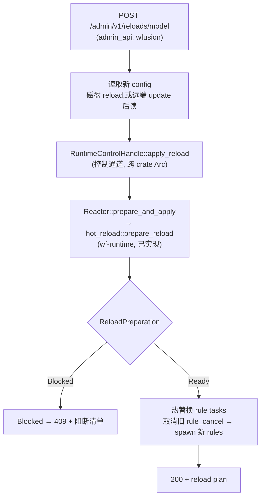

# admin_api reload 方案设计

> POST `/admin/v1/reloads/model` — 运行中的 wfusion daemon 收到请求后,触发 Reactor 热重载规则/配置(可选远端 update),返回结果。
>
> 状态:设计稿。覆盖范围:分层架构、可行性分析、接口契约、分阶段计划。

## 1. 背景与结论

前期调研给出的核心结论是「wfusion 缺运行时控制通道,wf-runtime 无 apply_reload,需先在 wp-reactor 建 RuntimeControlHandle 控制面」。**复核代码后这个结论需要修正**——它低估了现有基础:

| 维度 | 调研结论 | 复核后的事实 |
|------|----------|--------------|
| 热重载准备逻辑 | 缺,需新建 | **已完整实现**:`wf_runtime::hot_reload::prepare_reload` 含编译新规则 + 三层阻断检测 + 完整测试 |
| 重载产物 | 无 | **已定义**:`PreparedRuleReload { plan, next_config, next_rules, next_intermediate_targets, next_schemas }` |
| 运行时控制通道 | 完全缺失 | **确认缺失**:Reactor 只暴露 `cancel_token()`,无 `apply_reload` |
| admin_api 骨架 | 有 server、缺 reload 路由 | **确认**:`/admin/v1/runtime/status` 已实现,reload 路由缺失 |

**真正的缺口收敛为三点**(而非"建一整套控制面基建"):

1. **执行环节缺失**:`prepare_reload` 能算出"能否热重载 + 新规则产物",但 `PreparedRuleReload.next_rules` 当前标了 `#[allow(dead_code)]`——没有任何代码把产物应用到运行中的 Reactor。差的是"执行热替换"这一步。
2. **控制通道缺失**:Reactor 没有把热替换能力暴露给 admin_api 的 handle。
3. **HTTP 路由缺失**:admin_api 没有 reload 端点。

这把工程量从"建控制面基建"降到"实现 apply_reload 执行 + 控制通道 + 路由接线"。

## 2. 现状盘点(基于代码)

### 2.1 admin_api(wfusion crate,已实现)

`crates/wfusion/src/admin_api.rs`:

```text
AdminApiRuntime { local_addr, shutdown_tx, task }   // start_if_enabled 返回
AppState { bearer_token, instance_id, version, cancel }   // cancel = CancellationToken
路由: GET /admin/v1/runtime/status → { instance_id, version, accepting }
接缝: start_if_enabled(work_root, &AdminApiConf, cancel: CancellationToken)
```

`crates/wfusion/src/cli_config.rs::run_engine_inner` 的连线方式:

```text
Reactor::start(fusion_config, base_dir) → reactor
reactor.cancel_token()  →  admin_api::start_if_enabled(..., cancel)
```

admin_api 目前只拿到一个 `CancellationToken`(只能查询 `is_cancelled`,无法触发重载)。`AppState` 字段注释已明确标注这是 scheme-A,等 reload 落地后替换为 `RuntimeControlHandle`。

### 2.2 wf-runtime 热重载准备(已完整实现)

`wp-reactor/crates/wf-runtime/src/hot_reload/mod.rs`,通过 `lifecycle/mod.rs` 重新导出为公开 API:

```rust
pub fn prepare_reload(
    current_raw: &RawFusionConfigTree,
    current_config: &FusionConfig,
    next_raw: RawFusionConfigTree,
    next_config: FusionConfig,
    base_dir: &Path,
) -> RuntimeResult<ReloadPreparation>;

pub enum ReloadPreparation {
    Ready(Box<PreparedRuleReload>),   // 可热重载,产物已编译
    Blocked(FusionReloadPlan),         // 不可热重载,附阻断原因清单
}

pub struct PreparedRuleReload {
    pub plan: FusionReloadPlan,
    pub next_raw: RawFusionConfigTree,
    pub next_config: FusionConfig,
    pub(super) next_rules: Vec<RunRule>,           // 当前 dead_code,等 apply_reload 消费
    pub next_intermediate_targets: HashSet<String>,
    pub next_schemas: Vec<WindowSchema>,
}
```

`prepare_reload` 的三层阻断检测:

1. `build_reload_plan` — 对比 raw config 树,检出顶层需重启项。
2. `append_effective_config_blockers` — 检出影响运行时行为的配置变更(如 source/sink/admin_api 自身)。
3. `append_topology_blockers` — **关键**:编译新旧产物,若 `runtime_schemas` 集合变 或 `runtime_window_configs` 变 → `RequiresRestart`(因为 router 和 window registry 需重建)。

**能力边界**:只有"规则内部逻辑变更、且 schema/window 拓扑不变"才能热重载。改 schema 或 window 结构仍需重启。这是合理设计,本方案接受此边界。

### 2.3 Reactor(缺执行环节)

`lifecycle/mod.rs::Reactor`:

```rust
pub struct Reactor {
    cancel: CancellationToken,
    watchers: Vec<JoinHandle<RuntimeResult<()>>>,
    _external_runtime: Option<Arc<ExternalRuntime>>,
}
// 方法:start / shutdown / wait / cancel_token
```

Task 分组(start 顺序):`alert → evictor → rules → receiver → metrics`,join 时 LIFO。`rules` 组用独立的 `rule_cancel`(child token)控制,这是热替换的天然接缝。

**缺口**:
- 启动时 `current_raw` / `current_config` 被 `load_and_compile` 消费后未保留——而 `prepare_reload` 需要它们做对比基准。
- 无 `apply_reload`:没有代码消费 `PreparedRuleReload`。
- 无控制 handle 暴露给 admin_api。

### 2.4 数据流与共享对象(决定热替换可行性)

`BootstrapData` 与 rule task 的共享关系:

```text
router:   Arc<Router>         ← alert / evictor / rules / receiver / metrics 共享
dispatcher: Arc<SinkDispatcher> ← alert / rules 共享
window:   Arc<Window>         ← rule task 通过 window_sources 持有 Arc 引用
```

`spawn_rule_tasks` 构造的 `RuleTaskConfig` 持有:`executor`、`window_sources`(Arc<Window>)、`alert_tx`、`cancel`(child token)、`router`(Arc)、`metrics`、`intermediate_targets`。

**关键判断**:rule task 是无状态消费者——CEP 窗口状态(window 内的事件缓冲/聚合)存放在共享的 `Arc<Window>` / registry 中,rule task 只负责消费事件、驱动执行器。因此**取消旧 rule tasks 并 spawn 新 rule tasks,不会丢失 window 状态**,receiver 也无需重启。这正是热替换在架构上可行的根本原因。

## 3. 方案分层架构



三层职责:

| 层 | crate | 职责 | 现状 |
|----|-------|------|------|
| HTTP 层 | wfusion | reload 路由、bearer 鉴权、读新 config、序列化结果 | 缺路由,骨架在 |
| 控制通道 | wf-runtime | `RuntimeControlHandle`:Arc 包裹,暴露 `apply_reload`,跨线程发给 admin_api | 完全缺失 |
| 执行层 | wf-runtime | `Reactor::apply_reload`:保留 current_raw/config、调 prepare_reload、热替换 rule tasks | prepare_reload 已实现,执行缺失 |

## 4. 核心设计:热替换执行(apply_reload)

### 4.1 Reactor 保留重载基准

启动时保留对比基准,使运行时能调用 `prepare_reload`:

```rust
pub struct Reactor {
    cancel: CancellationToken,
    rule_cancel: CancellationToken,        // 新增:单独控制 rule tasks(已存在于 start 内部,需提升为字段)
    watchers: Vec<JoinHandle<...>>,
    // 新增:重载基准
    current_raw: RawFusionConfigTree,
    current_config: FusionConfig,
    base_dir: PathBuf,
    // 新增:共享对象(热替换时复用)
    router: Arc<Router>,
    dispatcher: Arc<SinkDispatcher>,
    alert_tx: mpsc::Sender<OutputRecord>,
    metrics: Option<Arc<RuntimeMetrics>>,
    intermediate_targets: HashSet<String>,
    _external_runtime: Option<Arc<ExternalRuntime>>,
}
```

> 说明:`router` / `dispatcher` / `alert_tx` 等在 `start` 内部已构造,当前只放进 BootstrapData 后被各 task 消费、未在 Reactor 上保留。热替换需要 Reactor 持有它们以 spawn 新 rule tasks。这是对 Reactor 字段的扩展,不改变现有 task 组织方式。

### 4.2 apply_reload 执行流程

```rust
impl Reactor {
    /// 准备并(若可行)执行热重载。可被 RuntimeControlHandle 转发调用。
    pub async fn apply_reload(
        &mut self,
        next_raw: RawFusionConfigTree,
        next_config: FusionConfig,
    ) -> RuntimeResult<ReloadOutcome> {
        // 1. 准备(复用已实现的 hot_reload::prepare_reload)
        let prep = prepare_reload(
            &self.current_raw, &self.current_config,
            next_raw, next_config, &self.base_dir,
        )?;
        match prep {
            ReloadPreparation::Blocked(plan) => Ok(ReloadOutcome::Blocked(plan)),
            ReloadPreparation::Ready(ready) => {
                // 2. 热替换 rule tasks
                self.swap_rule_tasks(ready.next_rules, ready.next_intermediate_targets).await?;
                // 3. 更新重载基准
                self.current_raw = ready.next_raw;
                self.current_config = ready.next_config;
                self.intermediate_targets = ready.next_intermediate_targets;
                Ok(ReloadOutcome::Applied(ready.plan))
            }
        }
    }

    async fn swap_rule_tasks(
        &mut self,
        new_rules: Vec<RunRule>,
        new_intermediate_targets: HashSet<String>,
    ) -> RuntimeResult<()> {
        // (a) 取消旧 rule tasks
        self.rule_cancel.cancel();
        // (b) 有界等待旧 task 退出(关键:见 §4.4)
        //     flush().await 里的阻塞 send().await 不响应 cancel,alert 通道背压时
        //     会无限卡住。超时则放弃 join,旧 task 留在后台自行退出,不阻塞热替换。
        let _ = tokio::time::timeout(
            self.reload_drain_timeout,   // 配置项,如 5s
            self.join_rule_group(),
        ).await;
        // (c) 重建 rule_cancel 供新一批 rule tasks 使用
        self.rule_cancel = CancellationToken::new();
        // (d) spawn 新 rule tasks(共享 router/dispatcher/alert_tx/metrics 不变)
        let group = spawn_rule_tasks(
            new_rules, &self.router, &new_intermediate_targets,
            self.alert_tx.clone(), self.rule_cancel.child_token(), self.metrics.clone(),
        );
        self.replace_rule_watch(group);
        Ok(())
    }
}
```

> 注:`watchers` 当前是 `Vec<JoinHandle>` 按位置管理。热替换需要能定位并替换 rule 组的 handle。实现时建议把 rule 组的 handle 单独持有(如 `rule_watch: JoinHandle`),其余组保持 LIFO join 语义不变。这是对 `watchers` 内部组织的小重构,不破坏 shutdown 排序。

### 4.3 数据连续性保证

| 对象 | 热替换时是否保留 | 说明 |
|------|------------------|------|
| CEP window 状态 | **保留** | 存于 `Arc<Window>` / registry,rule task 仅持有引用 |
| receiver | **不停** | 继续向 router 投递,router 路由到 window |
| alert sink | **不停** | 共享 `dispatcher`/`alert_tx`,新 rule tasks 复用同一通道 |
| in-flight 事件 | 短暂中断 | 旧 rule task 退出到新 rule task 接管之间,窗口内的事件由 window 缓冲,接管后继续消费。中断窗口很小(仅 rule task 重启耗时) |

**审计结论(已完成,见 §4.4)**:`run_rule_task` 在 cancel 分支里**已具备 drain 语义**——顺序调用 `pull_and_advance().await; flush().await;` 再退出,两者内部无嵌套 cancel 监听,会完整执行。但 `emit` 的阻塞 `send().await`(通道满时回退)**不响应 cancel**,一旦 alert 通道背压,旧 rule task 的 flush 会**无限卡住**,使 `join_rule_group().await` 无法返回、热替换挂起。因此 **P0 的 `swap_rule_tasks` 必须用带超时的有界等待**(见 §4.2),超时则放弃 join、让旧 task 在后台自行退出。

## 4.4 审计详情:run_rule_task 取消/flush 协议

复核 `engine_task/mod.rs::run_rule_task` + `engine_task/rule_task.rs::{pull_and_advance, flush, emit}`:

**主循环(`run_rule_task`)**:
```rust
loop {
    let notifications = register_notifications(&notifiers);
    task.pull_and_advance().await;                  // 每轮先消费
    tokio::select! {
        biased;
        _ = cancel.cancelled() => {
            task.pull_and_advance().await;           // 取消时再消费一轮
            task.flush().await;                      // 关闭所有活跃实例并 emit
            break;
        }
        _ = timeout_tick.tick() => task.scan_timeouts().await,
        _ = wait_any(&mut notifications) => {}
    }
}
```

逐项结论:

| 关注点 | 结论 |
|--------|------|
| 取消能否抢占 | 能。`biased` select 使 `cancel.cancelled()` 优先级最高 |
| 取消后是否 drain | 是。顺序调用 `pull_and_advance()` + `flush()`,无嵌套 select,完整执行 |
| `flush`/`pull`/`scan` 内部是否响应 cancel | **否**。均为纯顺序 `for` 循环 + `emit().await`,不监听 cancel |
| `emit` 发送策略 | 先 `try_send`;满则回退阻塞 `send().await`;Closed 则静默丢弃(记 metrics+warn) |
| 阻塞 `send().await` 是否响应 cancel | **否**——这是热替换的挂起风险点 |
| 热替换时 alert 通道是否会关闭 | 不会。`spawn_rule_tasks` 末尾 `drop(alert_tx)` 只 drop rule 侧 clone,alert 消费方仍持 sender,通道保持开启 |

**对 P0 的两个约束**:

1. **必须用超时 join**(已写入 §4.2):alert 通道背压时,旧 rule task 的 `flush`→`emit`→`send().await` 会无限阻塞。`swap_rule_tasks` 用 `tokio::time::timeout(reload_drain_timeout, join_rule_group())`,超时则放弃等待。代价:旧 task 可能仍在后台 flush,新 task 已接管——需保证新 task 不与残留旧 task 的 emit 竞争(两者写同一 alert 通道,顺序无保证,但不会 crash;若要求严格保序,reload 需串行化在 receiver 暂停期间)。
2. **flush 语义需对外明确**:`flush()` 调用 `machine.close_all_with_conv(CloseReason::Flush, ...)`,会**强制关闭旧规则的活跃 CEP 实例并产出告警**。因此热替换的语义是「旧实例 flush 关闭 + 新实例从当前 window 状态重新开始」,**不是「旧实例状态迁移到新规则」**。状态迁移(跨规则版本的有状态 handoff)超出本方案范围,需另行设计。

## 5. 控制通道:RuntimeControlHandle

Reactor 运行在 main task,admin_api 运行在独立 task。需要跨线程 handle。**采用 Channel 风格**(已选定):`RuntimeControlHandle` 持有 `mpsc::Sender<ReloadRequest>`,Reactor 在主循环 `select!` 上接收——无锁、Reactor 自行串行化处理、与现有 `wait_for_signal` 的 select 循环天然契合。

```rust
// wf-runtime 暴露
pub struct RuntimeControlHandle {
    tx: mpsc::Sender<ReloadRequest>,
    cancel: CancellationToken,        // 克隆自 Reactor 根 token,供 status 路由读 accepting
}

impl RuntimeControlHandle {
    pub async fn apply_reload(
        &self, raw: RawFusionConfigTree, config: FusionConfig,
    ) -> RuntimeResult<ReloadOutcome> {
        let (reply_tx, reply_rx) = oneshot::channel();
        self.tx.send(ReloadRequest::Reload { raw, config, reply: reply_tx }).await
            .map_err(|_| /* reactor 已退出 */ ...)?;
        reply_rx.await.map_err(|_| /* reactor 处理中退出 */ ...)?
    }
    pub fn cancel_token(&self) -> CancellationToken { self.cancel.clone() }
}

pub enum ReloadRequest {
    Reload { raw: RawFusionConfigTree, config: FusionConfig, reply: oneshot::Sender<RuntimeResult<ReloadOutcome>> },
}

pub enum ReloadOutcome {
    Applied(FusionReloadPlan),
    Blocked(FusionReloadPlan),
}
```

**Reactor 主循环改造**:`cli_config.rs` 现状是 `wait_for_signal(reactor.cancel_token()).await` 阻塞等待。Channel 风格需把 Reactor 改为自驱动——在 Reactor 内部 select 接收 reload 请求,同时保留信号/取消的 shutdown 语义。这意味着 `wait_for_signal` 的责任要并入 Reactor 主循环(或在 `cli_config` 层 select 信号与 reload,把 reload 请求转发给 Reactor)。实现细节见 P1。

`cli_config.rs::run_engine_inner` 连线改为:

```text
let reactor = Reactor::start(...).await?;
let control = reactor.control_handle();           // 新增:克隆控制 handle(Arc)
admin_api::start_if_enabled(..., control)         // AppState 持有 control 而非裸 cancel_token
```

admin_api 仍可通过 `control.cancel_token()` 获取 `status` 路由所需的 `accepting` 状态(向后兼容 scheme-A 的 status)。

## 6. HTTP 层:reload 路由(wfusion)

### 6.1 AppState 扩展

```rust
struct AppState {
    bearer_token: String,
    instance_id: String,
    version: String,
    control: RuntimeControlHandle,   // 替换原 cancel: CancellationToken
    // control.cancel_token() 用于 status 路由的 accepting
}
```

### 6.2 reload 端点

```
POST /admin/v1/reloads/model
Header: Authorization: Bearer <token>
Body: { "request_id"?: "...", "update_remote"?: false }   // update_remote 触发远端 sync 再 reload(可选,后续阶段)
```

行为:
1. 鉴权(复用现有 bearer 校验)。
2. 读取新 config:从 `work_root` 重新加载 `RawFusionConfigTree` + `FusionConfig`(复用 cli_config 的 resolve/load 逻辑)。
3. `control.apply_reload(raw, config).await` → `ReloadOutcome`。
4. 响应:
   - `Applied` → `200 {"request_id","accepted":true,"result":"applied","plan":{...}}`
   - `Blocked` → `409 {"request_id","accepted":false,"result":"blocked","blockers":[...]}`

> `handle_request` 现为手写 `match (method, path)`,加一条 `POST /admin/v1/reloads/model` 分支即可,无需引入路由框架。

## 7. 分阶段实施计划

| 阶段 | 范围 | crate | 产出 | 验证 |
|------|------|-------|------|------|
| **P0** | Reactor 保留重载基准 + `apply_reload` 执行热替换 | wf-runtime | `Reactor::apply_reload`、`swap_rule_tasks`(超时 join)、`reload_drain_timeout` 配置、rule 组 handle 重构 | wf-runtime 单测:(a) Ready → 热替换 → 新规则生效、window 状态不丢;(b) alert 通道背压 → 旧 task flush 超时不卡死热替换;(c) 验证 flush 以 `CloseReason::Flush` 关闭旧实例并产出告警 |
| **P1** | RuntimeControlHandle 控制通道(channel 风格) | wf-runtime | `RuntimeControlHandle`、`ReloadRequest`/`ReloadOutcome`、Reactor 主循环 select 接收(并入 `wait_for_signal` 语义) | 单测:(a) 跨 task 发 reload → Reactor 串行处理;(b) 并发 reload 请求被串行化/正确应答;(c) reload 期间 `status` 反映 reloading 态 |
| **P2** | admin_api reload 路由 | wfusion | `POST /admin/v1/reloads/model`、AppState 持 control、结果序列化 | admin_api 集测:正常 reload 200、blocked 409、鉴权失败 401 |
| **P3** | 端到端 + 远端 update(可选) | wfusion + wfadm | `update_remote` 触发远端 sync 后 reload | 集成测试:改规则文件 → POST reload → 新规则生效;远端链路对齐 wparse remote_ctrl |

**依赖顺序**:P0 → P1 → P2 → P3。P0/P1 在 wp-reactor,P2/P3 在 warp-fusion。因 warp-fusion 通过 git 依赖引用 wf-runtime,P0/P1 完成后需发布 wp-reactor 新版本并升级 warp-fusion 的 `wf-runtime` 依赖 tag。

## 8. 接口契约汇总

### wf-runtime(新增公开 API)

```rust
// 生命周期
impl Reactor {
    pub async fn apply_reload(&mut self, next_raw, next_config) -> RuntimeResult<ReloadOutcome>;
    pub fn control_handle(&self) -> RuntimeControlHandle;
}

// 控制通道
pub struct RuntimeControlHandle { .. }
impl RuntimeControlHandle {
    pub async fn apply_reload(&self, raw, config) -> RuntimeResult<ReloadOutcome>;
    pub fn cancel_token(&self) -> CancellationToken;   // 兼容 status 路由
}

pub enum ReloadOutcome {
    Applied(FusionReloadPlan),
    Blocked(FusionReloadPlan),
}
```

### wfusion(新增路由)

```
POST /admin/v1/reloads/model
→ 200 {accepted:true, result:"applied", plan} | 409 {accepted:false, result:"blocked", blockers}
```

## 9. 风险与未决项

1. **rule task 退出协议(已审计确认)**:`run_rule_task` 取消时已顺序执行 `pull_and_advance()` + `flush()`,有 drain 语义。但 `emit` 的阻塞 `send().await`(alert 通道满时回退)**不响应 cancel**,背压下会无限阻塞。**结论:P0 的 `swap_rule_tasks` 必须用超时 join**(见 §4.2/§4.4),超时则放弃等待旧 task、让其后台自行退出。代价是新旧 task 可能在超时窗口内并发写同一 alert 通道(不 crash、不丢消息,但顺序无保证);若需严格保序,需在 reload 期间暂停 receiver。
2. **flush 的 CloseReason 语义**:`flush()` 以 `CloseReason::Flush` 强制关闭旧规则的活跃 CEP 实例并产出告警。热替换语义是「旧实例 flush 关闭 + 新实例从当前 window 状态重新开始」,**非状态迁移**。跨规则版本的有状态 handoff 超出本方案范围。需在 API 文档与 `result:"applied"` 的 plan 中体现这一行为,避免使用者误以为无缝迁移。
3. **并发 reload**:同一时刻多个 reload 请求。channel 风格天然串行化(Reactor 单消费者),需在响应中体现"重载进行中"状态,或排队/拒绝(返回 409/429)。
4. **reload 期间的 accepting 状态**:热替换 rule tasks 期间,`status` 路由的 `accepting` 应如何反映?建议引入 `reloading` 中间态(status 返回 `accepting:true, reloading:true`)。
5. **远端 update 链路**:`update_remote` 复用 wfadm 的远端 sync(`remote_ctrl` README 提到的 init → daemon → reload 链路)。需确认 wfadm 侧 sync 逻辑可被 daemon 内部调用,而非仅 CLI。若不可,P3 需在 wfusion 内实现轻量 sync。
6. **git 依赖升级**:P0/P1 落在 wp-reactor,warp-fusion 需等 wp-reactor 发版后升级 tag。开发期可用 `@gxl:block(local_reactor)` 切换到 path 依赖联调。

## 10. 与原方案的差异说明

原方案(基于前期调研)将"RuntimeControlHandle 控制面"定位为必须先建的大型前置基建。本设计经代码复核后认为:

- **热重载的难点(编译新规则 + 阻断判定)已由 `hot_reload::prepare_reload` 解决**,且已有测试覆盖。
- 真正缺口是"执行 + 通道 + 路由"三段接线,每段都是增量,不需要推翻现有 Reactor/task 组织。
- 因此 RuntimeControlHandle 是"接线件"而非"新基建",工程量与风险均显著低于原方案估计。
